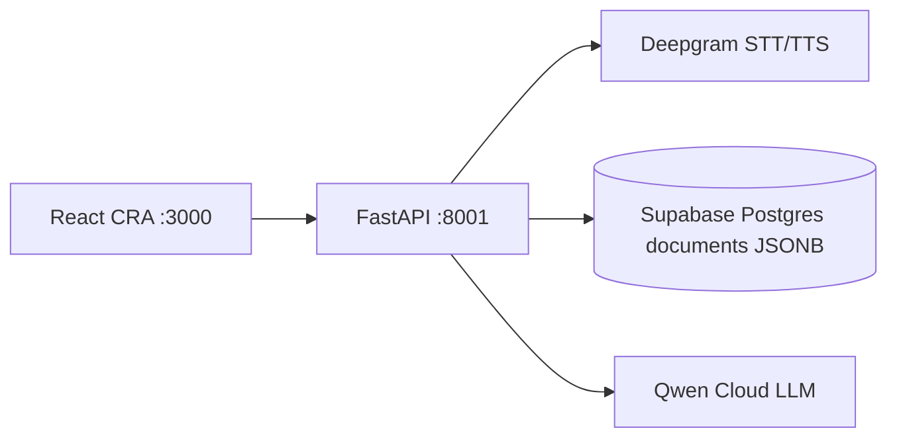

# Architecture

> Owner: architect agent. Update in the same task as any structural change.

## System Overview

SOA campus-service demo: React CRA talks to FastAPI. FastAPI owns demo JWT/RBAC, the orchestrator, Deepgram voice proxy, and a Motor-shaped document API. Persistence is Supabase Postgres via asyncpg on the transaction pooler.

## Component Diagram

## Components
| Component | Responsibility | Talks to |
|---|---|---|
| `frontend/` | Crextio UI, role switcher, intake, ledger | FastAPI `/api` |
| `backend/server.py` | HTTP + Deepgram proxy + seed on boot | db, engine, escrow |
| `backend/db.py` | Motor-shaped JSONB adapter | Supabase pooler |
| `backend/security.py` | Demo JWT + RBAC | `users` docs |
| Deepgram | EN/HI STT (`nova-2`) + Aura TTS | API key in `.env` |

## Data Flow

1. Demo login issues a FastAPI JWT. Role switcher re-auths via `/api/auth/demo-login`.
2. Writes go through `db.<collection>` into `public.documents` (`collection`, `id`, `doc jsonb`).
3. Voice: browser MediaRecorder → `/api/voice/transcribe` or `/api/conversation/turn` → Deepgram. Odia stays labeled demo voice.

## Boundaries & Rules
- What must stay server-side: JWT secret, Deepgram key, DB password, escrow Fernet key, vault ciphertext.
- Frontend never talks to Supabase directly. No Supabase Auth.
- FastAPI is the authz boundary. The DB role is the project owner, so RLS is off (see TECH_DECISIONS).
