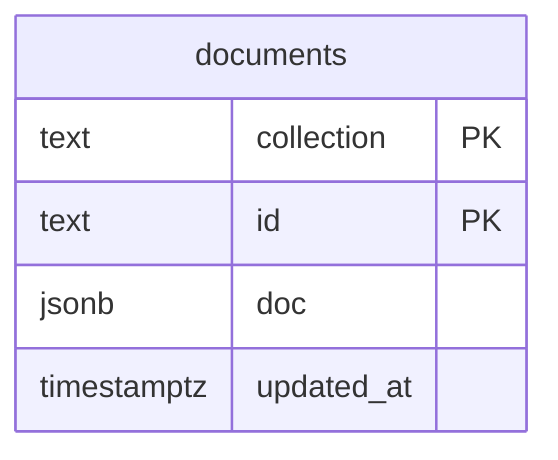

# Database Rules

> Owner: backend-dev. RLS/ownership rules here are LAW — security-auditor audits against this file.

## Engine & Conventions

Postgres 17 on Supabase. One table, JSONB documents, camelCase keys inside `doc` so the existing FastAPI/React contract does not change. Backend connects as the database owner through the transaction pooler (`:6543`) with `statement_cache_size=0`.

## Schema


Logical collections stored in `documents.collection`:
`service_requests`, `audit_events`, `counters`, `users`, `labs`, `policies`, `policy_chunks`, `identity_vault`, `vault_log`, `conversations`, `certificates`, `maintenance_tickets`, `lab_bookings`, `grievances`, `tool_executions`.

Counters increment atomically:

```sql
INSERT INTO documents (collection, id, doc)
VALUES ('counters', $1, jsonb_build_object('_id', $1, 'value', 1))
ON CONFLICT (collection, id) DO UPDATE
SET doc = jsonb_set(documents.doc, '{value}',
  to_jsonb(coalesce((documents.doc->>'value')::int, 0) + 1));
```

## Security / RLS
| Table | RLS on? | Policy (who reads / who writes) |
|---|---|---|
| `documents` | **No** | Only the FastAPI owner role connects. Client never gets the DB URL. |

- ADR-002 records why RLS is off for this demo.
- Ownership is enforced in FastAPI (`request.read_own` vs `request.read_all`, `vault.access`).
- Identity escrow stays Fernet-encrypted in `identity_vault` docs.

## Migrations
- Location: `supabase/migrations/`
- Rules: additive. Applied on the linked cloud project. Do not edit `20260817161600_soa_documents.sql` now that it is live.
